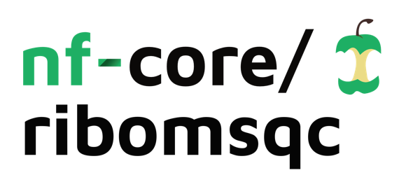

<h1>
  <picture>
    <source media="(prefers-color-scheme: dark)" srcset="docs/images/nf-core-ribomsqc_logo_dark.png">
    
  </picture>
</h1>

[](https://github.com/nf-core/ribomsqc/actions/workflows/ci.yml)
[](https://github.com/nf-core/ribomsqc/actions/workflows/linting.yml)[](https://nf-co.re/ribomsqc/results)[](https://doi.org/10.5281/zenodo.XXXXXXX)
[](https://www.nf-test.com)

[](https://www.nextflow.io/)
[](https://docs.conda.io/en/latest/)
[](https://www.docker.com/)
[](https://sylabs.io/docs/)
[](https://cloud.seqera.io/launch?pipeline=https://github.com/nf-core/ribomsqc)

[](https://nfcore.slack.com/channels/ribomsqc)[](https://twitter.com/nf_core)[](https://mstdn.science/@nf_core)[](https://www.youtube.com/c/nf-core)

## Introduction

**nf-core/ribomsqc** is a bioinformatics pipeline that processes `RAW` files from mass spectrometry instruments, converts them to `mzML` format, extracts `XIC`s for selected analytes, generates plots, and summarizes outputs via MultiQC. It is tailored for quality control of ribonucleoside analysis.

## Usage

> [!NOTE]
> If you are new to Nextflow and nf-core, please refer to [this page](https://nf-co.re/docs/usage/installation) on how to set-up Nextflow.

First, prepare a samplesheet with your input data like:

```csv title="samplesheet.csv"
id,raw_file
20240315_QCN1_001_03_New_STD,/full/path/to/file.raw
```

- `id`: Sample identifier
- `file`: Path to the `RAW` file

Now, you can run the pipeline using:

```bash
nextflow run nf-core/ribomsqc \
  --input samplesheet.csv \
  --analytes_tsv qcn1.tsv \
  --analyte m3C \
  --rt_tolerance 150 \
  --mz_tolerance 20 \
  --ms_level 2 \
  --plot_xic_ms1 false \
  --plot_xic_ms2 false \
  --plot_output_path xic_plot \
  --overwrite_tsv true \
  --outdir results \
  -profile singularity
```

> [!WARNING]
> Please provide pipeline parameters via the CLI or Nextflow `-params-file` option.

For more information, see the [usage docs](https://nf-co.re/ribomsqc/usage) and [parameters](https://nf-co.re/ribomsqc/parameters).

## Pipeline output

See [results page](https://nf-co.re/ribomsqc/results) for example output and [output docs](https://nf-co.re/ribomsqc/output).

## Credits

nf-core/ribomsqc was originally written by Roger Olivella.

## Contributions and Support

For help, visit [Slack #ribomsqc](https://nfcore.slack.com/channels/ribomsqc) or see [contributing guide](.github/CONTRIBUTING.md).

## Citations

See [`CITATIONS.md`](CITATIONS.md) for tool references.

> Ewels PA *et al.* (2020) _The nf-core framework_. Nat Biotechnol. [doi:10.1038/s41587-020-0439-x](https://doi.org/10.1038/s41587-020-0439-x)